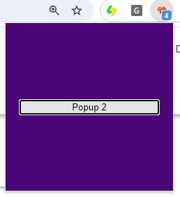

# Chrome Action Sample Extension
Chrome extension that changes the action icon, badge text and popup ui randomly when clicked. When the extension is opened the popup will have a button that does the same thing.

You can clone the example the Google Team provides. https://github.com/GoogleChrome/chrome-extensions-samples

The Chrome extension will we be building, changes the action icon, badge text and popup ui randomly when clicked. When the extension is opened the popup will have a button that does the same thing. You can clone the project we are about to show you here. https://github.com/BuildChromeExtensions/chromeaction

We are going to use several different functions from chrome.action to change details about the icon. 

Note: if there is a default_popup set the chrome.action.onClick does not work, because it overrides the onClick function open the popup. But if there is no popup set then chrome.action.onClick should work. chrome.action function are one of many that only work in popup javascript files and background scripts NOT in content scripts.
